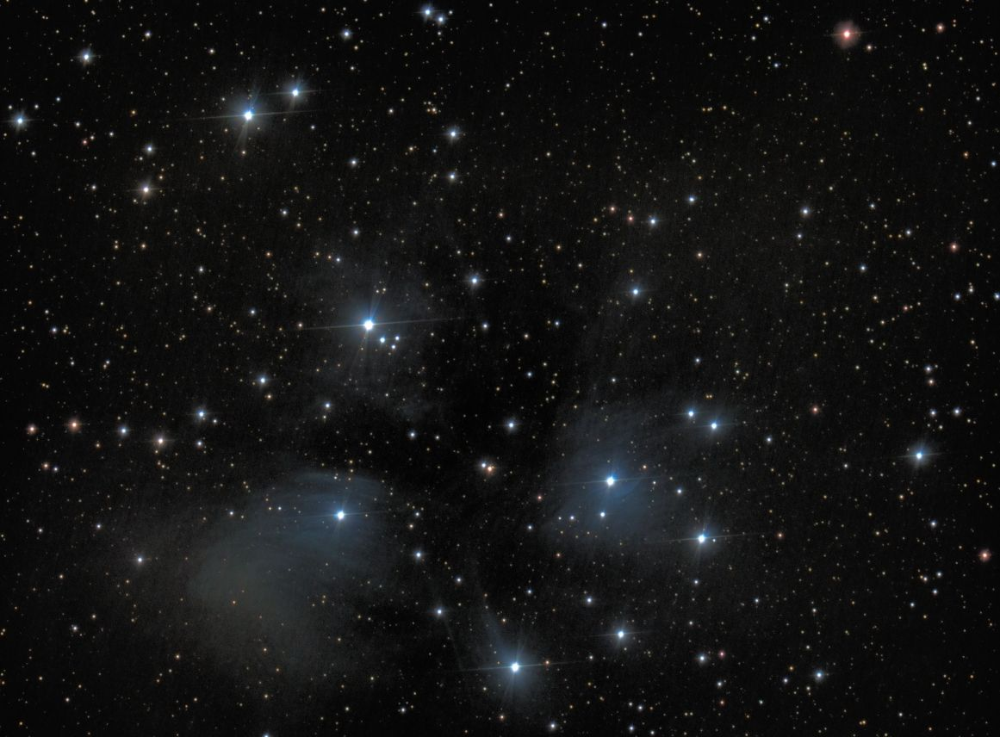
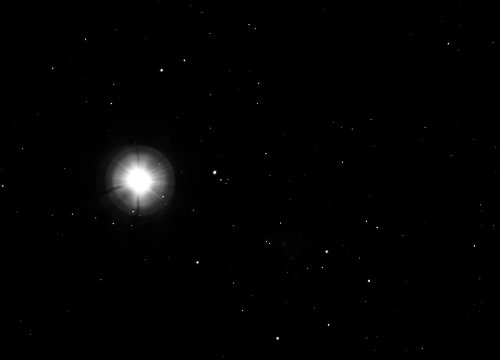

This is a test - not a live post!

Test figures and captioning

---



---

  

  ---

[^fna]: Taken: 2020-02-22  Exposure: 202 x 3s = 606s
_**M45  (move mouse over image to show the "dipper" shape, mouse off image to restore)**_ (details here [^fna])

The cluster is dominated by hot blue and luminous stars that have formed within the last 100 million years. Reflection nebulae around the brightest stars were once thought to be left over material from the formation of the cluster, but are now considered likely to be an unrelated dust cloud in the interstellar medium through which the stars are currently passing.

The Pleiades were probably formed from a compact configuration that resembled the Orion Nebula. Astronomers estimate that the cluster will survive for about another 250 million years, after which it will disperse due to gravitational interactions with its galactic neighborhood.

[^2]: Taken: 2020-99-99  Exposure: 61s
_**On April 23 of this year the planet Venus passed through the Pleiades**_  (details here [^2])

 

The planet Venus wandered through the Pleiades this past April.  (After all, the word "planet" is derived from an ancient Greek word for "wanderer".)
Since Venus is so MUCH brighter than any of the stars, it is WAY overexposed in this image and completely washes out the faint nebulosity seen in the earlier image! In actuality, it was a little half-moon shape with a diameter two-thirds the distance between the double star indicated when you mouse over the image.

Footnotes:

