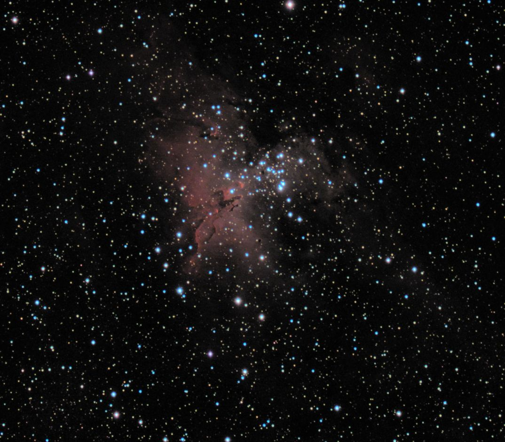

M16, the Eagle Nebula, is one of several spectacular objects now coming into view in the summer evening sky. It has been made famous by the Hubble Space Telescope "Pillars of Creation" photograph - easily the most ubiquitous of all Hubble images.

M16 is a conspicuous cloud of interstellar gas and dust and is a region of active star formation, having already created an open cluster of hot young blue stars that light it up. It is filled with dark regions and globules, including a peculiar dark column and a luminous rim around the cluster. It is sometimes said that the outlines of the nebula resemble a three-leaf clover. Or, with a little more imagination, it looks like an eagle with open wings.

The nebula and cluster are about 50 light years in diameter and 7000 light years away from us.

_**The M16 Cluster and Eagle Nebula**_ &nbsp;&nbsp; (June 27, 2020 - 10 min total exposure) 

The following image is a two-times enlargement of the central part of the nebula, rotated about 45 degrees to the left. The mouse-over notes show the location of the Hubble image.

_**The Hubble "Pillars of Creation" are located in the heart of the Eagle Nebula**_   (move mouse over image to show notes, mouse off image to remove notes)
 

You have noticed significant differences in color between my images and the Hubble image. Hubble images are all false color – meaning they start out as multiple black and white images taken in different parts of the spectrum (including the ultraviolet and the infrared). These multiple images are assigned visible colors and then combined into a false color image. For the "Pillars" image, red shows light from singly-ionized sulphur, green shows light from neutral hydrogen, and blue shows light from doubly-ionized oxygen.

You can click [here]( https://www.spacetelescope.org/images/opo9544a/) to check out the original image at the Hubble Space Telescope site.
If you'd like to read more about the Eagle Nebula you can click [here](https://en.wikipedia.org/wiki/Eagle_Nebula) for a Wikipedia article.

<!--
I am very pleased at how much detail my modest setup can show in the Eagle Nebula, and my wife is very pleased that it cost WAY less than Hubble's $1.5 billion and counting!
-->
