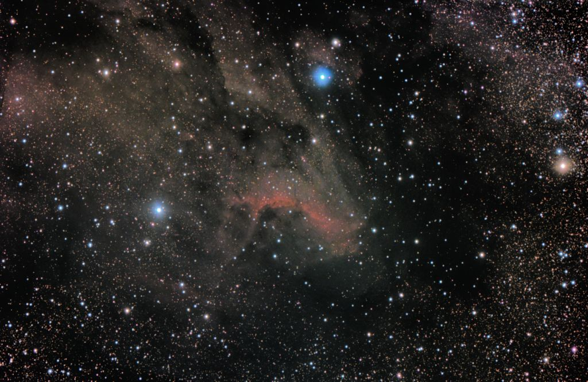

The Pelican Nebula (also known as IC 5070) is an emission nebula whose outlines bear a resemblance to a pelican, giving rise to its name. 

 (If you are viewing this on a phone or other small display, be sure to scroll to the right to see the complete image!)

_**The Pelican Nebula (IC 5070)**_&nbsp;&nbsp; (33 min total exposure Nov 16, 2020) 

This region of the Milky Way is a particularly active and chaotic mix of star formation and evolving gas clouds. The position and balance of the stars and gas will gradually change to leave the nebula looking completely different millions of years from now.

This cosmic pelican is located near the east "coast" of its more prominent neighbor, the [North American Nebula](../North-American-Nebula/index.html) (off the upper edge of this image), and is divided from it by a thin molecular cloud filled with dark dust.

